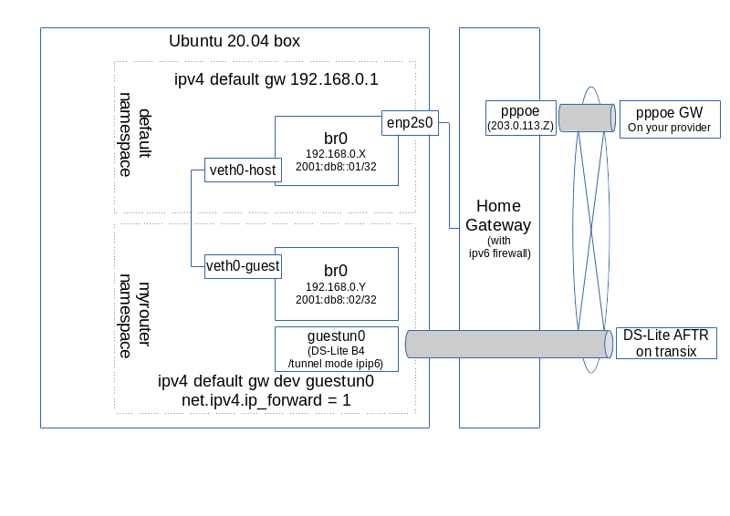

# netns-ds-lite-router
linux DS-Lite virtual router with network namespace(netns) 

- 契約プロバイダの無料オプションで transix の ds-lite (ipv4 over ipv6) が提供されている
- ds-liteは pppoeと較べて段違いに快適(googleのspeed testで500Mbps程度出る)。
  なので iPhone, iPad ,テレビ などの カジュアルアウトバウンドでも使いたい
- 一方、ds-liteで使用される IPv4アドレス は Transix の CGNATで「みんなで共用」。
  クラウドへのsshなどでソースIP制御に使えないし、サーバ用途でのインバウンドも受けられない。
- 作業母艦 の ubuntu 20.04 からの tcpアウトバウンドは pppoe を使用しつつ、
  その他の カジュアルアウトバウンドは ds-lite を使用する構成にしてみた 

注意:
- ipv6 の セキュリティは Home Gateway に任せる構成
- flets系で提供される Home Gateway の ipv6 フィルタは NGN 網内全開放がデフォルトなので特に注意

Todo:
- netns上で squid を動作させている部分を スクリプト化しておく
- dnsmasq の dchp で、ds-lite経路と proxyを配布してる設定を スクリプト化しておく

